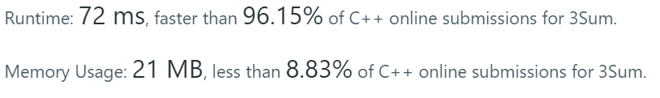

*Medium*

## Description

Given an array nums of n integers, are there elements a, b, c in nums such that a + b + c = 0? Find all unique triplets in the array which gives the sum of zero.

Note:

The solution set must not contain duplicate triplets.

Example:

```
Given array nums = [-1, 0, 1, 2, -1, -4],

A solution set is:
[
  [-1, 0, 1],
  [-1, -1, 2]
]
```


## My Struggling

It looks like the Two Sum Up question which uses a hash table. At first I think about using hash table for a while and give eventually. The given array has repeated numbers in this question while while Two-Sum-Up doesn't.

I glanced over the Discuss and then "Sort and two pointers" caught my eyes. So I tried.

```
class Solution {
public:
    vector<vector<int>> threeSum(vector<int>& nums) {
        if(nums.empty()) return {};
        vector<vector<int>> res;
        set<vector<int>>s;
        sort(nums.begin(), nums.end());
        for(int i = 1; i < nums.size() - 1; i++){
            int left = i - 1;
            int right = i + 1;
            while(left >= 0 && right <= nums.size()-1){
            	int sum = nums[i] + nums[left] + nums[right];
                if(sum < 0) right++;
                else if (sum > 0) left--;
                else{
                    vector<int> triplet = {nums[left], nums[i], nums[right]};
                    s.insert(triplet);
                    left--;
                    right++;
                }
            }
        }
        res.assign(s.begin(), s.end());
        return res;
    }
};
```

Sort the array from small to large firstly. The key point is to set `nums[i]` as the first number, define `left` as `i-1` initially and `right` as `i+1`, and check `sum = nums[i] + nums[left] + nums[right] ` 

- If `sum > 0`, we need a less number to make `sum` close to $0$, `left--`;
- If `sum < 0`, we need a larger number to make `sum` close to $0$, `right++`;

Do this repeatedly until reaching the edges of array.

### Remove Duplicates

For example, in`[-1,0,0,1]`, the result should be only `[[-1,0,1]]`. 

I come up with the idea of using `std::set` to store results which have no repeating elements. It requires a transform from `std::set` to `std::vector`

`res.assign(s.begin(), s.end());`

Seems good? Anyway...


Totally inefficient~

Well, C++11 provides convenient duplicate removing function `std::unique`

`res.erase(unique(res.begin(), res.end()))`

> `unique` replace the duplicate elements by the next element that is not a duplicate, and return an iterator to the element that follows the last element not removed. It would not change the size of the container. The container **must be ordered**.
>
> In short word, it put the non-repetitive to the front.
>
> `13345667`to
>
> `13456767`
>
> Use `.erase` to really remove duplicates elements. 

```c++
sort(res.begin(), res.end());
vector<vector<int>>::iterator it = std::unique(res.begin(), res.end());
if(it!= res.end())res.erase(it, res.end());
```

It works in VS2019. In the LeetCode, it pass most cases but shows **Time Limit Exceeded** when dealing with the input full of more than one thousand `0`.

There must be better solution.


## Solution: Sorting and Two Pointers

This time, after we choose `i` as the first number, the searching range is defined as $[i+1, nums.size()-1]$

- Sort the array given;
- Traverse the array by index `i`:
  - If `nums[i] > 0`,  the sum of three numbers must be greater than $0. Just return the result;
  - If `nums[i]` is same as the proceeding number, we have dealt with this case. Skip this case to avoid duplication. For example `[-1,0,0,1]`, skip it when `i` is $2$ (The second `0`);
  - Determine the searching range, `left = i + 1`, `right = nums.size()-1`, continue this loop when `left < right`
    - Calculate the `sum`. If `sum` is $0$, add this case to the result. Increase `left` to the first one which has different value of the proceeding one. Decrease `right` to the first one which has different value of the next one. (This rule is to skip some duplications. For example in `[-2,-1,-1,1,1,3]`, when `i` is $0$ and `-2` is the first number, after verifying `-2 + -1 + 3 == 0`, skip the second `-1` )
    - If `sum` is greater than $0$, `right--`;
    - if `sum` is less than $0$, `left++`.

```c++
class Solution {
public:
    vector<vector<int>> threeSum(vector<int>& nums) {
        if(nums.empty()) return {};
        vector<vector<int>> res;
        sort(nums.begin(), nums.end());
        for(int i = 0; i < nums.size() - 1; i++){
            if(nums[i] > 0)break;
            if(i>0 && nums[i] == nums[i-1])continue;
            int left = i + 1;
            int right = nums.size()-1;
            while(left < right){
            	int sum = nums[i] + nums[left] + nums[right];
                if(sum == 0){
                    vector<int> triplet = {nums[i], nums[left], nums[right]};
                    res.push_back(triplet);
                    while(left < right && nums[left+1] == nums[left])left++;
                    while(left < right && nums[right-1] == nums[right])right--;
                    left++;
                    right--;
                }
                else if(sum < 0) left++;
                else right--;
            }
        }
        return res;
    }
};
```

Time complexity:$O(n^2)$

Space complexity: $O(1)$



Excellent!

> ###### Why can't we simply skip duplicate first numbers in the solution of expanding searching range from center?
>
> When the other two numbers are both on the right side of the first number, we can use `if(i>0 && nums[i] == nums[i-1])continue;` to skip. But if these two numbers are on the different sides, we need to check more special cases.
>
> For example, in `[-1,0,0,1]`, the second `0` should be skipped.
>
> In `[-2,-1,-1,2]`, the second `-1` should not be skipped since `-1 + -1 + 2 == 0`.
>
> We could only check if the result vector contains the newly-generated result. But it is rather time-consuming.
>
> The solution of only searching one side ( $[i+1, nums.size()-1]$)is better. It simplify the process of removing duplicates.

