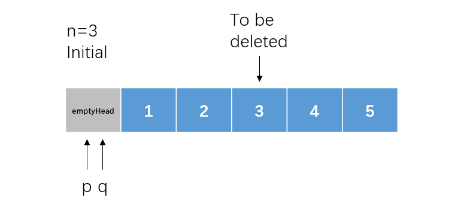
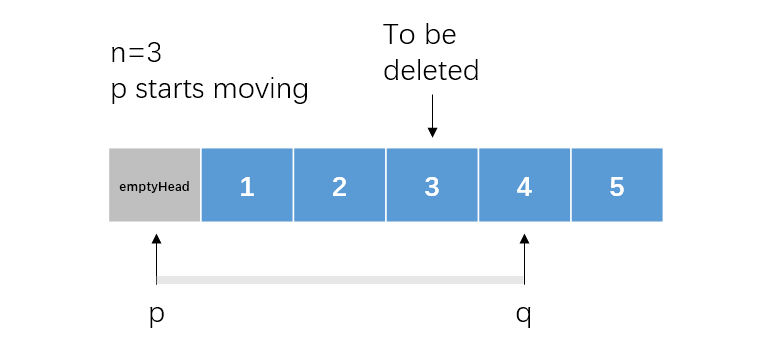
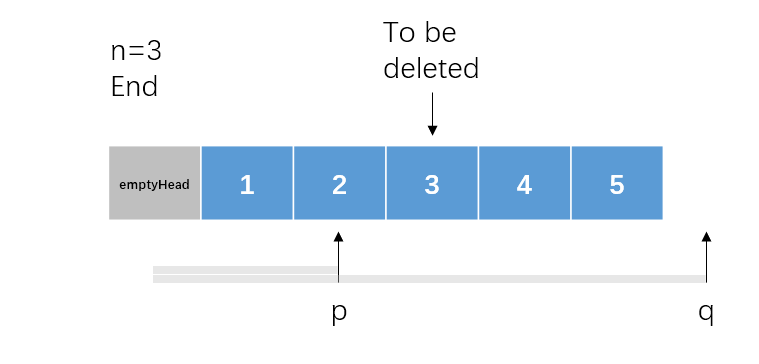

*Medium*

## Description

Given a linked list, remove the n-th node from the end of list and return its head.

**Example:**

```c++
Given linked list: 1->2->3->4->5, and n = 2.

After removing the second node from the end, the linked list becomes 1->2->3->5.
```

**Note:**

Given n will always be valid.

**Follow up:**

Could you do this in one pass?

## Solution 1 : Recursion

To be honest, recursion is not the best way to solve this question. But I came up with this idea firstly: count when recursion returns.

Moreover, we need an extra empty head to deal with some special situations like deleting the head node.

```c++
class Solution {
public:
    ListNode* removeNthFromEnd(ListNode* head, int n) {
        ListNode* emptyHead = new ListNode();
        emptyHead->next = head;
        int count = -1;
        func(emptyHead, count, n);
        return emptyHead->next;
    }
    void func(ListNode* cur, int& count, int n){
        if(cur != nullptr) func(cur->next, count, n);
        count++;
        //Do this in the proceeding node of the node to be deleted
        if(n == count - 1) cur->next = cur->next->next; 
    }
};
```

Surprisingly, its runtime is faster than 88.73% of C++ online submissions.

Essentially, recursion traverses the list twice. We need a new solution to do this in one pass.

## Solution 2: Two Pointers

Set two pointers `p` and `q`. Make them `n+1` nodes apart. When `q` reaches the end of the list, `p` is exactly at the postion one node ahead of the node to be deleted.





 

```c++
class Solution {
public:
    ListNode* removeNthFromEnd(ListNode* head, int n) {
        ListNode* emptyHead = new ListNode();
        emptyHead->next = head;
        ListNode* p = emptyHead, *q = p;
        int count = 0;
        while(q != nullptr){
            q = q->next;
            if(++count > n+1)p = p->next;
        }
        p->next = p->next->next;
        return emptyHead->next;
    }
};
```

Still beat 88.73%...

This runtime comparison is determined by my ID and submission location?

