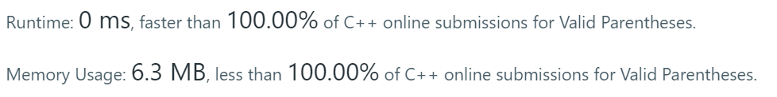

*Easy*

## Description

Given a string containing just the characters `'('`, `')'`, `'{'`, `'}'`, `'['` and `']'`, determine if the input string is valid.

An input string is valid if:

1. Open brackets must be closed by the same type of brackets.
2. Open brackets must be closed in the correct order.

Note that an empty string is also considered valid.

**Example 1:**

```
Input: "()"
Output: true
```

**Example 2:**

```
Input: "()[]{}"
Output: true
```

**Example 3:**

```
Input: "(]"
Output: false
```

**Example 4:**

```
Input: "([)]"
Output: false
```

**Example 5:**

```
Input: "{[]}"
Output: true
```


## Solution: Stack

Just use an assitant stack. 

And I found in ASCII table, `'(' + 1 == ')'` while `'[' + 2 == ']'`,  `'{' + 2 == '}'`

```c++
class Solution {
public:
    bool isValid(string s) {
        if(s.empty())return true;
        stack<char> match;
        for(int i = 0; i < s.size(); i++){
            if(!match.empty() && (s[i] == match.top()+1 || s[i] == match.top()+2))
                match.pop();
            else match.push(s[i]);
        }
        return match.empty();
    }
};
```



0 ms? Serious?