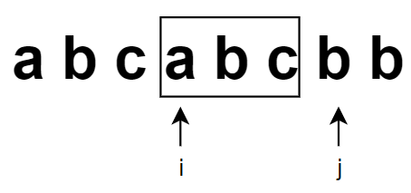

*Medium*

## Description

Given a string, find the length of the **longest substring** without repeating characters.

**Example 1:**

```
Input: "abcabcbb"
Output: 3 
Explanation: The answer is "abc", with the length of 3. 
```

**Example 2:**

```
Input: "bbbbb"
Output: 1
Explanation: The answer is "b", with the length of 1.
```

**Example 3:**

```
Input: "pwwkew"
Output: 3
Explanation: The answer is "wke", with the length of 3. 
             Note that the answer must be a substring, "pwke" is a subsequence and not a substring.
```


## Solution 1: Brute Force

Brute Force solves anything...

Start from each character, and check every next character until there is one character existing in the substring. Every check will cost $O(n)$ time. 

As a result, the time complexity is $O(n^3)$.

Obviously, it is not a wise choice.

## Solution 2: Sliding Window

Imagine a certain length of window that includes a range of elements. It start from $i$ and stop before $j$, in other words, [$i, j$ ）(left-closed, right-opend).

The boundaries of both sides slide individually, and the elements in the sliding window represent the substring.



In addition,  to check if a character is already in the substring, scannnig the substring leads to an enormous time cost. However, we could also maintain a hash table to accelerate this process.

> When it comes to the question of finding one element in a large list, consider about a **hash table** to realize $O(1)$ time complexity.

### Pseudocode

1. If the string is empty, return 0;
2. Initilize `i` and `j`, both start from `0`. `max` will always record the max length of substring (Set as $1$ initially);
3. Get into the `while` loop, it will not stop until one of `i` or `j` reaches the end.
4. Find the element with index `j` in the hash table `<char, int>`.
   1. If it exist in the hash table and the index `k` found by hash function is greater or equal to `i`, which means this character is already in the substring. Then set `i` as `k+1`.
   2. If it does not exist in the hash table, or the index `k` found by hash function is less than `i`, which means it does not in the substring. Then upgrade the hash table to save the new index, slide `j` to `j+1`.
5. Upgrade `max`, then back to the loop condition check.
6. `max` is the answer.

### Get into the code

```c++
class Solution {
public:
    int lengthOfLongestSubstring(string s) {
        if(s.empty())return 0;
        int max = 1;
        int i = 0, j = 0;
        unordered_map <char, int> mp;
        while(i < s.size() && j < s.size()){
            unordered_map<char, int>::iterator it = mp.find(s[j]);
            if(it != mp.end() && it->second >= i){
                i = it->second + 1;
            }
            else{
                mp[s[j]] = j;
                j++;
            }
            max = std::max(j - i, max);
        }
        return max;
    }
};
```


- Time complexity: $O(n)$ .

> Index `j` will iterate n times.

- Space complexity: $O(n, k)$, where $k$ is the size of hash table.

