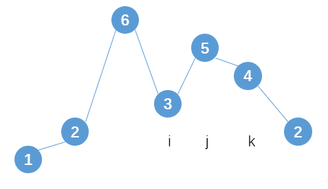
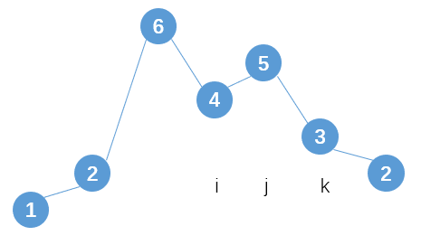
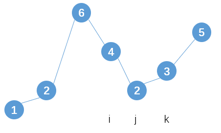

*Medium*

## Description

Implement next permutation, which rearranges numbers into the lexicographically next greater permutation of numbers.

If such arrangement is not possible, it must rearrange it as the lowest possible order (ie, sorted in ascending order).

The replacement must be in-place and use only constant extra memory.

Here are some examples. Inputs are in the left-hand column and its corresponding outputs are in the right-hand column.

```
1,2,3 → 1,3,2
3,2,1 → 1,2,3
1,1,5 → 1,5,1
```

## Find the regularity

As for `3,2,1`, we know there is no next permutation is possible since no other permutation could be larger than it. But in terms of `1,3,2`, it has a feasible permutation since we know `2` or `3` could be put before `1` and it would be a larger number.

- We want it to be **larger**. (Except it is the largest)
- If it is going to be larger, we want it to **increase by a smallest amount**.

Back to `1,3,2`, we have two question:

1. How can we know the position of digit that we should exchange with larger digit? (In this case, it's `1`)
2. Which digit chosen from `2` or `3` we exchange with  `1`  such that the number will increase by the smallest amount?

Try to answer them:

1. From the right, we find the **first digit that is larger than its succeeding digit** (`nums[i] < nums[j]`). That's the digit waiting to be replaced. 

2. From the right, we find the **first digit that is larger than `nums[i]`**. Exchange it (`nums[k]`) with `nums[i]`.

After that, we should **rearrange the order** of $[j,end)$ to a increasing sequence to ensure the new number increased by the smallest amount.

### Flow Diagram

1. Find `i`, `k`;



2. Exchange `nums[i]` and `nums[k]`



3. Rearrange $[j, end)$



### Code

```c++
class Solution {
public:
    void nextPermutation(vector<int>& nums) {
        if(nums.empty())return;
        int j = nums.size()-1;
        int i = j - 1;
        while(i >= 0 && nums[i] >= nums[j]){
            --i;
            --j;
        }
        if(i == -1){
            //Already the largest number
            sort(nums.begin(), nums.end());
            return;
        }
        //Find k
        int k;
        for(k = nums.size()-1; k > i; k--){
            if(nums[i] < nums[k])break;
        }
        //Swap
        int temp = nums[i];
        nums[i] = nums[k];
        nums[k] = temp;
        //Rearrange [j,end)
        sort(nums.begin()+j, nums.end());
        return;
    }
};
```

### Time Complexity

It has $O(n)$ time complexity since it only need to traverse the array twice, one for finding `i` and the other one for finding `k`. The rearrangement is a sorting process which costs $O(log\ n)$. In conclusion, it is $O(n)$.