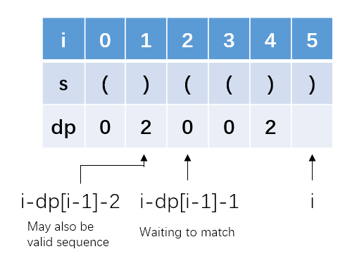

*Hard*

## Description

Given a string containing just the characters '(' and ')', find the length of the longest valid (well-formed) parentheses substring.

Example 1:

```
Input: "(()"
Output: 2
Explanation: The longest valid parentheses substring is "()"
```

Example 2:

```
Input: ")()())"
Output: 4
Explanation: The longest valid parentheses substring is "()()"
```

## Solution 1: Brute Force

```c++
class Solution {
public:
    int longestValidParentheses(string s) {
        stack<char> match;
        int maxLen = 0;
        int i, j;
        for(i = 0; i < s.size(); i++){
            int end = -1;
            for(j = i; j < s.size(); j++){
                if(s[j] == ')'){
                    if(match.empty())break;
                    else match.pop();
                }
                else match.push(s[j]);
                if(match.empty()) end = j;
            }
            if(end - i + 1 > maxLen)maxLen = end - i + 1;
            while(!match.empty())match.pop();
        }
        return maxLen;
    }
};
```

Well, it works but is too slow. It has $O(n^2)$ time complexity. There certainly exist faster solutions.

## Solution 2: Dynamic Programming

Key point of dynamic programming: we can record intermediate results to get rid of repeatedly judging.

At first, I came up with a two dimensional `dp` array in which `dp[i][j]` represents the valid length of parentheses from `i` to `j`. For example, when $s_i...s_j$ is`()()`, `dp[i][j]` is $4$. And when $s_i...s_j$ is `(()()()`, `dp[i][j]` is $0$.

However, this method dose not works perfectly. When we want to know `dp[i][j]`, we can not decide which value we should use either `dp[i+2][j]` or `dp[i][j-2]`. We have to use a stack to judge all characters from `i` to `j`.

A feasible solution is an one dimensional `dp` array in which `dp[i]` represents **the valid length of parentheses ending at **`i`. For example as for `()())`, `dp[3]` is $4$ and `dp[4]` is $0$.

### Transition Equations

- If `s[i]` is `(`, there is no valid pattern ending with `(`. Hence, `dp[i]` should be $0$;
- If `s[i]` is `)`, a `)` should find its corresponding `(`:
  - If `s[i-1]` is `(`, the pattern is like `......()`. `dp[i]` should be `dp[i-2] + 2 `;
  - If `s[i-1]` is `)`, this `)` should find its `(`. Since we know `dp[i-1]` when indicates the length of a valid sequence, the corresponding `(` may locate at `i - dp[i-1] -1 `:
    - If `s[i - dp[i-1] -1] ` is not `(`, the match of `)` at `s[i]` dose not hold. `dp[i]` should be $0$.
    
    - If `s[i - dp[i-1] -1] ` is `(`, the match holds. In addition, there may exist valid sequence before `s[i-dp[i-1]-1]`. As a result, `dp[i] = dp[i-1] + 2 + dp[i-dp[i-1]-2]`.
    
      > For example `()(())`, `dp[5]` should be `dp[i-1] + 2 + dp[i-dp[i-1]-2] = 2 + 2 + 2 = 6`.
    
      

### Initial Status

`dp[0] = 0`

### Boundary Conditions

The index of `dp` should not be lower than $0$.

### Code

```c++
class Solution {
public:
    int longestValidParentheses(string s) {
        if(s.size() < 2) return 0;
        vector<int> dp(s.size());
        int maxLen = 0;
        dp[0] = 0;
        for(int i = 1; i < s.size(); i++){
            if(s[i] == '(') dp[i] = 0;
            else if(s[i-1] == '(') dp[i] = (i>1 ? dp[i-2] : 0) + 2;
            else if(i - dp[i-1] - 1 >= 0 && s[i - dp[i-1] - 1] == '('){
                dp[i] = dp[i-1] + 2 + 
                ((i - dp[i-1] - 2) > 0 ? dp[i - dp[i-1] - 2] : 0);
            }
            if(dp[i] > maxLen) maxLen = dp[i];
        }
        return maxLen;
    }
};
```

### Time Complexity

$O(n)$. It traverse the array only once.

