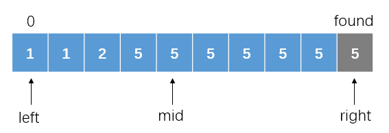
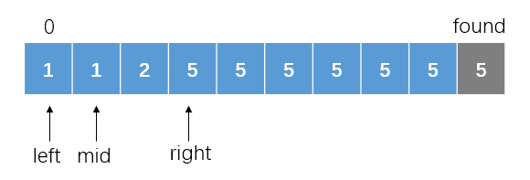
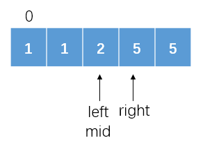
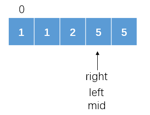
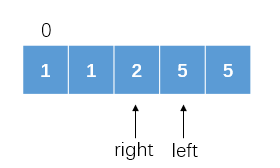
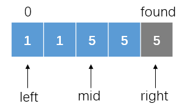
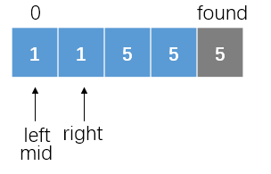
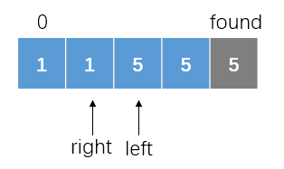

*Medium*

## Description

Given an array of integers nums sorted in ascending order, find the starting and ending position of a given target value.

Your algorithm's runtime complexity must be in the order of O(log n).

If the target is not found in the array, return [-1, -1].

Example 1:

```
Input: nums = [5,7,7,8,8,10], target = 8
Output: [3,4]
```

Example 2:

```
Input: nums = [5,7,7,8,8,10], target = 6
Output: [-1,-1]
```


## Solution: Binary Search

- Find one of the target numbers in the array. The index of this one is `found`;
- Find the starting index in `[0, found]`;
- Find the ending index in `[found, nums.size()-1]`.

### The Boundaries

A problem is the searching strategy for finding lower boundary and the upper boundary. A feasible solution is to narrow the range of searching and return the `left`.

#### A Example of Finding the Lower Boundary



In the case, target is $5$. We should reset `right` to narrow down the range. `right = mid - 1`.

> The range is left-closed and right-closed in this solution.



It is found that `nums[left]` is lower than `target`. Reset `left` as `mid + 1`.



And so on. After the next step, it turns out to be:



The condition for the end of the cycle is `left > right`. So we still need to check the value of `nums[mid]`. It is equal to `target`. Follow the adjustment strategy, `right = mid - 1`



At the end of the loop, `left` refers the the starting position of the target values.

#### Why `left` is the right index?

Consider this case where target is still $5$：



After the first step, it turns to be:



It seems too narrow and does not include the first $5$. But after the loop:



At the previous step, `left = mid + 1` since `nums[mid]` is lower that target. As a result, `left` exactly comes to the position of starting index.

> `left` will probably exceed the right side of the array. We need to check it to avoid overflow.

### Code

```c++
class Solution {
public:
    int binary(vector<int>& nums, int target, int left, int right){
        int mid;
        while(left <= right){
            mid = (left + right) / 2;
            if(nums[mid] > target) right = mid - 1;
            else if(nums[mid] < target) left = mid + 1;
            else break;
        }
        return mid;
    }
    int lower_bound(vector<int>& nums, int target, int left, int right){
        int mid;
        while(left <= right){
            mid = (left + right) / 2;
            if(nums[mid] < target) left = mid + 1;
            else if(nums[mid] == target) right = mid - 1;
        }
        if(left >= nums.size()) return -1;
        return left;
    }
    int upper_bound(vector<int>& nums, int target, int left, int right){
        int mid;
        while(left <= right){
            mid = (left + right) / 2;
            if(nums[mid] > target) right = mid - 1;
            else left = mid + 1;
        }
        if(right < 0) return -1;
        return right;
    }
    vector<int> searchRange(vector<int>& nums, int target) {
        vector<int> res = {-1,-1};
        if(nums.empty()) return res;
        int found = binary(nums, target, 0, nums.size()-1);
        if(nums[found] != target) return res;
        int start = lower_bound(nums, target, 0, found);
        int end = upper_bound(nums, target, found, nums.size()-1);
        res[0] = start;
        res[1] = end;
        return res;
    }
};
```

