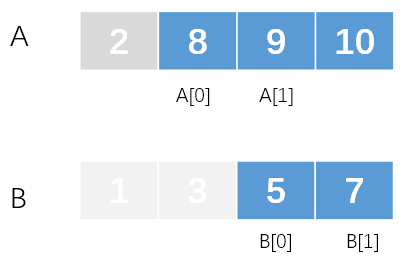

*Hard*

## Description

There are two sorted arrays **nums1** and **nums2** of size m and n respectively.

Find the median of the two sorted arrays. The overall run time complexity should be $O(log (m+n))$.

You may assume **nums1** and **nums2** cannot be both empty.

**Example 1:**

```
nums1 = [1, 3]
nums2 = [2]

The median is 2.0
```

**Example 2:**

```
nums1 = [1, 2]
nums2 = [3, 4]

The median is (2 + 3)/2 = 2.5
```

---

## Intuition

Find the median of two sorted arrays. If possible, the simplest solution is Merge Sort which has $O(m+n)$ time complexity.

In the description, it indicates it may have a solution based on Binary Search.

> The overall run time complexity should be $O(log (m+n))$.


## Solution 1: Merge Sort

Set two indexes, `i` in `nums1` and  `j` in `nums2`. Compare the `nums1[i]` with `nums2[j]` , add the smaller one to a new array.

The new array only costs at most $(m+n)/2+1$ units of space since we only need to merge sort before the median. And, we do the merge sort for  $count = (m+n)/2+1$ times.

According to the parity of $m+n$, calculate the median in different ways:

- If $m+n$ is odd, the last element of new arrays (`nums[count-1]`) is exactly the median.
- If $m+n$ is even, the median is the average of last two elements.

Don't forget the **boundary conditions** when either of `nums1` or `nums2` is empty, and when `i` or `j` reaches the end of each array.

```c++
class Solution {
public:
    double findMedianSortedArrays(vector<int>& nums1, vector<int>& nums2) {
        int m = nums1.size(), n = nums2.size();
        vector<int> nums(m+n);
        int i = 0, j = 0;
        int count = 0;
        if(m == 0){
            return n % 2 == 0 ? ((double)nums2[n/2 - 1]+(double)nums2[n/2])/2 : nums2[n/2];
        }
        if(n == 0){
            return m % 2 == 0 ? ((double)nums1[m/2 - 1]+(double)nums1[m/2])/2 : nums1[m/2];
        }
        while(count  < (m+n)/2 + 1){
            if(i >= m)nums[count] = nums2[j++];
            else if(j >= n)nums[count] = nums1[i++];
            else if(nums1[i] < nums2[j]) nums[count] = nums1[i++];
            else nums[count] = nums2[j++];
            count++;
        }
        if((m+n) % 2 == 0)
            return ((double)nums[count - 1]+(double)nums[count - 2])/2;
        else 
            return nums[count-1];
        return 0;
    }
};
```

Time complexity: $O(m+n)$, not in line with the question.

The code is not terse, neither. QAQ


## Solution 2: Binary Search

Though it may have a solution using binary search, I did not come up with how to realize the "Cut" operation. Take it easy, it is a hard question.

In LeetCode-cn, an article received more than 866 likes. After reading in depth, I'd like to conclude by myself.

[Solution by windliang](https://leetcode-cn.com/problems/median-of-two-sorted-arrays/solution/xiang-xi-tong-su-de-si-lu-fen-xi-duo-jie-fa-by-w-2/)

### What is median?

A median divides a set of data into two equal length groups. One group is always greater than the other. The key point is to **divide**.

For two arrays, we could also divide them separately. And after the **Cut**, we can find the median of the two arrays.

The question turns into **how to determine the position of cut in each array**.

### How to cut?

For an array with $n$ elements, there are $n+1$ kinds of cutting.


For array A (`nums1`) with $m$ elements, we specify the cutting position is `i` , and `j` for array B (`nums2`) with `n` elements. If `i` 's value is $k$, from the picture we can figure out there are $k$ elements before the cutting position.

#### When $m+n$ is odd


In this situation, A has $m=4$ elements, and B has $n=5$ elements. $m+n$ is odd. $i=2, j=3$. The maximum of `A[i-1]` and `B[j-1]` is the median.

In fact, because there are equal elements on the left and right sides of the median, and we include the median in the left part, $i+j=(m-i)+(n-j)+1$

Thus, $j=(m+n+1)/2-i$.

If the maximum of `A[i-1]` and `B[j-1]` is the median, there must be 

`A[i-1] <= B[j] and B[j-1] <= A[i]`.

#### When $m+n$ is even


In this situation, similarly, there must be

$i+j=(m-i)+(n-j)$

Thus, $j=(m+n)/2-i$.

However, we could also change it to $j=(m+n+1)/2-i$ since `j + 1/2 = j` when `j` is a `int` variable.

And, `A[i-1] <= B[j] and B[j-1] <= A[i]`.

### Find the cutting position

If we specify a value of `i`, then `j` is determined. We can change the `i` **in a  binary search pattern.** Check the the relationship of `A[i-1], B[j] and B[j-1], A[i]` to determine whether `i` should be increased or decreased.

#### When `i` should be increased


First of all, remember the condition of finding the median successfully, 

`A[i-1] <= B[j] and B[j-1] <= A[i]`

But in this case, `B[j-1] > A[i]`. It indicates the left side of `i` in A is too small, `i` should be greater. Certainly, we should guarantee $0\leq i\leq m, 0\leq j\leq n$, which will be discussed as boundary conditions later.

#### When `i` should be decreased


From the picture,  `A[i-1] > B[j]`. It indicates the right side of `j` in B is two small, `j` should be greater. We can decrease `i` to accomplish it. Also, $0\leq i\leq m, 0\leq j\leq n$.

#### Boundary conditions

In the process of changing `i` as well as `j`, it's probable that the cutting position moves to the edge of arrays. In these cases, several of `A[i-1], A[i], B[j-1], B[j]` would be wrong.

##### Cutting position is at the left edge


It happens when `i==0` or `j==0`.

If `i==0`, the max value of left side is `B[j-1]`;

If `j==0`, the max value of left side is `A[i-1]`.

The min value of right side is `min(A[i], B[j])`.

##### Cutting position is at the left edge


It happens when `i==m` or `j==n`.

If `i==m`, the min value of right side is `B[j]`;

If `j==n`, the min value of right side is `A[i]`.

The max value of left side is `max(A[i-1], B[j-1])`.

Knowing the min value of right side and max value of left side, we could calculate the median.

> When $m+n$ is odd, since we include the median in the left side, we could return the max value of left side, which is exactly what we need.

### Code

```c++
class Solution {
public:
    double findMedianSortedArrays(vector<int>& nums1, vector<int>& nums2) {
        int m = nums1.size();
        int n = nums2.size();
        if(m == 0){
            return n % 2 == 0 ? (nums2[n/2 - 1]+nums2[n/2])/2.0 : nums2[n/2];
        }
        if(n == 0){
            return m % 2 == 0 ? (nums1[m/2 - 1]+nums1[m/2])/2.0 : nums1[m/2];
        }
        if(n<m) return findMedianSortedArrays(nums2, nums1);
        int maxLeft = INT_MIN, minRight = INT_MAX;
        int lowerBound = 0, upperBound = m;
        int i, j;
        while(lowerBound <= upperBound){
            i = (lowerBound + upperBound)/2;
            j = (m + n + 1) / 2 - i;
            if(i != 0 && j != n && nums1[i-1] > nums2[j]) upperBound = i - 1;
            else if(i != m && j != 0 && nums2[j-1] > nums1[i]) lowerBound = i + 1;
            else break;
            cout<<i<<endl;
        }
        cout<<i<<endl;
        if(i == 0) maxLeft = nums2[j-1];
        else if(j == 0) maxLeft = nums1[i-1];
        else maxLeft = std::max(nums1[i-1], nums2[j-1]);
        if((m + n) % 2 == 1) return maxLeft;
        
        if(i == m) minRight = nums2[j];
        else if (j == n) minRight = nums1[i];
        else minRight = std::min(nums1[i],nums2[j]);
        
        return (minRight + maxLeft)/2.0;
    }
};
```

### Some doubts

1. Why we need ensure $m\leq n$?

   > `if(n<m) return findMedianSortedArrays(nums2, nums1);`

   `j` is determined by `i`. Assume that if `nums1` has more elements than `nums2`. When `i` is a very small value like $0$, $j=(m+n+1)/2-i$  would be a great value which leads to index `j` out of bounds.

   > When $i=0$, $j=(m+n+1)/2-i$ reached its maximum value. However, $j$ should be lower or equal to $n$.
   >
   > $j=(m+n+1)/2-i \leq n$ 
   >
   > $m+1\leq n$
   >
   > When $m+n$ is even, $m\leq n$
   >
   > Above all, $m\leq n$

2. Will it break the loop when the first time `i` or `j` reaches the edge?

   No.

   ```c++
   if(i != 0 && j != n && nums1[i-1] > nums2[j]) upperBound = i - 1;
   else if(i != m && j != 0 && nums2[j-1] > nums1[i]) lowerBound = i + 1;
   else break;
   ```

   It will examine both of the requirements for a median:

   `A[i-1] <= B[j] and B[j-1] <= A[i]`

   If no increment or decrement of `i` can be done, it will break then.


## Solution 3: To Find the `k`th smallest number

Finding the median is actually an special case of finding the `k`th smallest number.

In each loop, we examine the `k/2`th number in A and B. 

- If the `k/2`th number of A is smaller than that of B, it indicates that the first `k/2` numbers of A do not contains the `k`th smallest number in the two arrays. We can exclude these numbers of A, and then find the `k-k/2`th smallest number.
- If the `k/2`th number of A is greater than that of B, similarly, we can exclude first `k/2` numbers of B, and then find the `k-k/2`th smallest number.

By doing so, we achieve $O(log (m+n))$ time complexity.

> **Why can we exclude?**
>
> The numbers in A and B are both ordered. To find the `k`th number, we separate these $k$ numbers in two parts, and assume $k/2$ in A, $k/2$ in B. However, if the `k/2`th number of A is smaller than that of B, i.e. the max value of $k/2$ value in A is smaller than `B[k/2-1]`. In that way the $k/2$ numbers can only exist before the `k`th number in terms of the two arrays.

### Explain with figures

- Compare the `k/2`th numbers in A and B


- `A[k/2 - 1] > B[k/2 - 1]`, we can exclude the first $k/2$ numbers of B. 


- Then we just need to find the  `k - k/2`th numbers in the new arrays. Doing these steps until we find `k` is $1$


### Boundary conditions

- When $m+n$ is odd, we can return the max value of `A[0]` and `B[0]` after the loop (when $k$ is 1)


- When $m+n$ is even, there are a few possibilities. We can just simply choose the min value from these three.

  - The median is the average of `A[0]` and `B[1]`

    

  - The median is the average of `A[0]` and `A[1]`
  
    
  
  - The median is the average of `A[0]` and `A[1]`
  
    


- If A or B is empty, just find the `k`th number from the other array (`k` is the value obtained after the loop).

- If the size of A or B is smaller than `k/2`, then compare the last number of this array with the `k/2`th number in the other array:
  - If smaller, than exclude all left numbers of this array.
  - If greater, than exclude first `k/2` numbers of the other array.

> In fact, we can guarantee A has more elements than B to simplify boundary conditions.

### Code

```c++
class Solution {
public:
    double findMedianSortedArrays(vector<int>& nums1, vector<int>& nums2) {
        int m = nums1.size();
        int n = nums2.size();
        int k = (m + n + 1) / 2;
        if(m > n)return findMedianSortedArrays(nums2, nums1);
        while(k>1 && nums1.size()!=0){
            if(k/2 > nums1.size()){
                if(nums1[nums1.size()-1] < nums2[k/2 - 1]){
                    k -= nums1.size();
                    nums1.clear();
                    break;
                }
                else nums2.erase(nums2.begin(), nums2.begin()+ k/2);
            }
            else if(nums1[k/2 - 1] < nums2[k/2 - 1])
                nums1.erase(nums1.begin(), nums1.begin()+ k/2);
            else nums2.erase(nums2.begin(), nums2.begin()+ k/2);
            k = k - (k/2);
        }
        if(nums1.empty())
            return (m+n) % 2 == 0 ? (nums2[k-1]+nums2[k])/2.0 : nums2[k-1];
        else if((m+n)%2 != 0) 
            return std::min(nums1[0], nums2[0]);
        else {
            double t1 = INT_MAX, t2 = INT_MAX, t3 = INT_MAX;
            t3 = (nums1[0] + nums2[0])/2.0;
            if(nums1.size() > 1) t1 =  (nums1[0] + nums1[1])/2.0;
            if(nums2.size() > 1) t2 =  (nums2[0] + nums2[1])/2.0;
            return std::min(t1, std::min(t2, t3));
        }
    }
};
```

This solution is rather tricky, it transfer the question to an old one. I learned this solution from the Discuss and then realized by myself. 

Well to be honest, there are too many boundary conditions.

### Code optimized

How to code elegantly? That a rather esoteric question.

After learning an sample code which received a lot of likes, I implemented a C++ version of the code.

- Rather than divide into three situation when $m+n$ is odd, we could just get the average of `k`th and `k+1`th numbers.

- Instead of `.erase()` function which requires extra operations on memory, we can just define the lower and upper bounds of an array.

- If the size of A  is smaller than `k/2`, rather than dealing with this special case, we can   assign  `i`  in a more clever way. The same is true for `j`.

  `int i = start1 + std::min(k/2, len1) - 1;`

```c++
class Solution {
public:
    double findMedianSortedArrays(vector<int>& nums1, vector<int>& nums2) {
        int m = nums1.size();
        int n = nums2.size();
        if((m+n) % 2 != 0)
            return getKth(nums1, 0, m, nums2, 0, n, (m + n + 1) / 2);
        else
            return (getKth(nums1, 0, m, nums2, 0, n, (m + n + 1) / 2) +
                    getKth(nums1, 0, m, nums2, 0, n, (m + n + 1) / 2 + 1)) / 2.0;
    }
    
    int getKth(vector<int>& nums1, int start1, int end1,
               vector<int>& nums2, int start2, int end2, int k){
        int len1 = end1 - start1;
        int len2 = end2 - start2;
        if(len1 > len2) 
            return getKth(nums2, start2, end2, nums1, start1, end1, k);
        if(len1 == 0) return nums2[start2 + k - 1];
        if(k == 1)return std::min(nums1[start1], nums2[start2]);
        int i = start1 + std::min(k/2, len1) - 1;
        int j = start2 + std::min(k/2, len2) - 1;
        if(nums1[i] < nums2[j])
            return getKth(nums1, i + 1, end1,
                          nums2, start2, end2, k - (i+1 - start1));
        else return getKth(nums1, start1, end1,
                          nums2, j + 1, end2, k - (j+1 - start2));
    }
};
```

