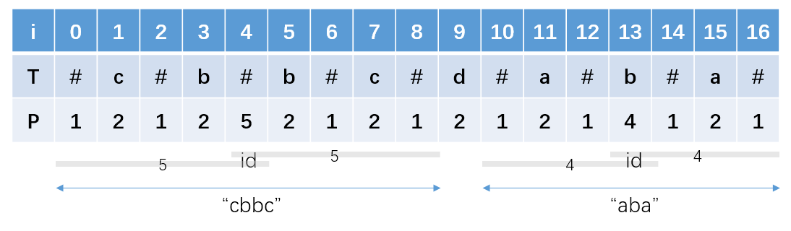
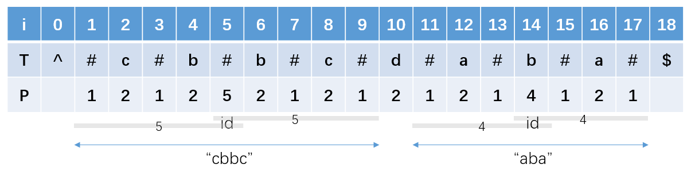
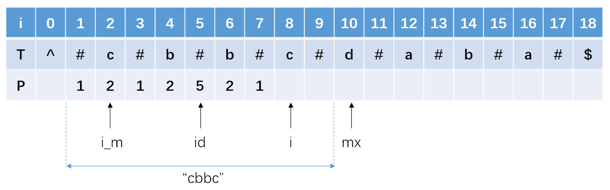
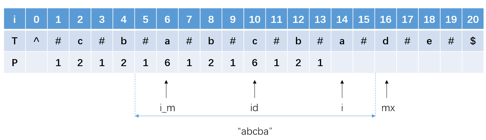
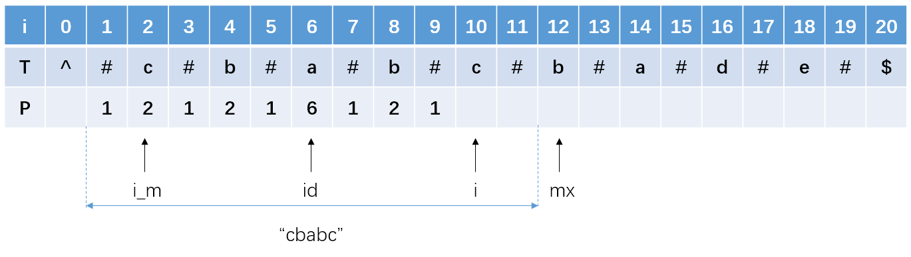

*Medium*

## Description

Given a string **s**, find the longest palindromic substring in **s**. You may assume that the maximum length of **s** is 1000.

**Example 1:**

```
Input: "babad"
Output: "bab"
Note: "aba" is also a valid answer.
```

**Example 2:**

```
Input: "cbbd"
Output: "bb"
```

## Solution 1: Expand from Center

I tend to avoid brute force solution. Trying to find all substrings seems too time-consuming. However, when I think about how to extract palindromic strings, I find that they are all symmetrical.

> The center of "aba" is "b"
>
> The center of "abba" is exactly between these two "b";

What if we check it by starting from the center and expanding to both sides. I believe it is more efficient than simply finding all substrings.

```c++
class Solution {
public:
    string longestPalindrome(string s) {
        if(s.empty()) return "";
        if(s.size() == 1)return s;
        int start = 0, end = 0;
        for(int i = 1; i < s.size(); i++){
            int len1 = findLength(s, i, i);
            int len2 = findLength(s, i-1, i);
            int max = std::max(len1, len2);
            if(max > end - start){
                start = i - max / 2;
                end = i + (max+1) / 2;
            }
        }
        return s.substr(start, end - start);
    }
    int findLength(string& s, int left, int right){
        while(left >= 0 && right <= s.size()-1 && s[left] == s[right]){
            left--;
            right++;
        }
        return right - left - 1;
    }
};
```

Time complexity: $O(n^2)$

Space complexity: $O(1)$


At first, I did not merge the two situations:

> 1. The center is one of the characters: "aba"
>
> 2. The center is between two of the characters: "abba"

After learning the idea of the official solution, I find that I could define a method `findLength(string& s, int left, int right)`.

> Call this methed twice. 
>
>             int len1 = findLength(s, i, i);
>             int len2 = findLength(s, i-1, i);

When get into the function, $left=right=i$ corresponds to "aba" situation, and $left= i-1, right=i$ is related to "abba" situation.

In each loop circle, check these two situations and update `start` and `end` (left-closes, right-opened) if it found a longer palindromic substring. Return it by the methed `substr` from `string`.

> ##### std::[string](http://www.cplusplus.com/reference/string/string/)::substr
>
> Returns a newly constructed [string](http://www.cplusplus.com/string) object with its value initialized to a copy of a substring of this object.
>
> **No string::iterator support in this function**
>
> ```c++
> #include<string>
> string str = "012345";
> int pos = 1;
> int len = 3;
> string newstr1 = str.substr(pos, len); //123
> string newstr2 = str.substr(pos); //12345
> ```


## Solution 2: Dynamic Programming

```c++
class Solution {
public:
    string longestPalindrome(string s) {
        if(s.empty()) return "";
        if(s.size() == 1)return s;
        int len = s.size();
        int start = 0, end = 0;
        vector<vector<bool> > dp(len, vector<bool>(len, false));
        for(int i = 0; i < len; i++){
            dp[i][i] = true;
            if(i+1 < len && s[i] == s[i+1]) dp[i][i+1] = true;
        }
        for(int i = len - 1; i >= 0; i--){
            for(int j = i; j < len; j++){
                if(i+1 <= j-1  && s[i] == s[j]) 
                    dp[i][j] = dp[i+1][j-1];
                if(dp[i][j] && end - start < j - i){
                    end = j;
                    start = i;
                }
            }
        }
        return s.substr(start, end - start + 1);
    }
};
```

The key point is the `dp` arrays. We define:

$P(i,j)=\left\{\begin{aligned}&true,\  if\ the\ substring\ S_i...S_j \ is \ a \ palindrome\\&false,\ otherwise\end{aligned}\right.$

The transfer equation:

$P(i,j)=(P(i+1,j-1)\ and\ S_i==S_j)$

> It looks like expanding from the center. But we use `dp` arrays to store whether the substring $S_i...S_j$ is a palindrome, thus optimize time consuming.

And we need some initial conditions:

1. Single character

   $P(i,i)=true$

2. Two consecutive identical characters

   $P(i,i+1)=(S_i==S_{i+1})$

### Why do I need to iterate `i` from the end?

For example, to know `dp[3][7]`, we need know `dp[4][6]` at first. In other word, know `dp[i+1` then know `dp[i`. As a result, we can initial `i` with the `len - 1`;

### Complexity and Optimization

Time complexity: $O(n^2)$

Space complexity: $O(n^2)$

But we actually did not use all the `dp[][]`. We don't need the space when $i> j$. And when we deal with the `i` row,  we don't need the `dp[i+2]` row. Can we use an one dimensional array `dp[]` ?

```c++
class Solution {
public:
    string longestPalindrome(string s) {
        if(s.empty()) return "";
        if(s.size() == 1)return s;
        int len = s.size();
        int start = 0, end = 0;
        vector<bool> dp(len, false);
        for(int i = len - 1; i >= 0; i--){
            for(int j = len - 1; j >= i; j--){
                dp[j] = (s[i] == s[j]) && (j - i < 3 || dp[j-1]);
                if(dp[j] && end - start < j - i){
                    end = j;
                    start = i;
                }
            }
        }
        return s.substr(start, end - start + 1);
    }
};
```

As for "abba", the change of `dp` is shown as below.


`i` and `j` both start from `len-1`. `i` end at $0$, and `j` end at `i`. The values from `i` to `len-1` in `dp` array is covered in every `i`'s loop.


## Solution 3: Manacher's Algorithm

It is said that a person named Manacher invented this algorithm in 1975. The most awesome thing is that it has $O(n)$ time complexity.

### Pretreatment

#### Add `#`

We have talked about the two different situations when the center of a palindrome is at the potion of a character, or between two characters. In the part, we could add one `#` between every two characters to merge these two cases.

> The new string always have odd number of characters, which simplifies some discussions.

Furthermore, we define an  auxiliary array `P[]` whose elements record the the "**radius**"

of a palindrome in the new string.



> In the above picture, "cbbc" is a palindrome. The center of "cbba" is defined as `id`. And on the both sides, it has a length of $5$ (including `#`).
>
> Similarly, "aba" has a length of $4$.

**The actual length of a palindrome is `P[i] - 1 `**, no matter the numbers of the palindrome is odd or even.

#### Add Sentinels

We still don't know the starting position of a palindrome. Consider "cbba" in the above picture. `i` is $4$ at the `id` and `P[i]` is $5$. It goes wrong when `i - P[i]`.

It also helps to jump out of the loop when comparing the boundaries, we need to add two different sentinels (I LIKE this name) on both sides (`^` and `$`). Then the new string is like:



Let's check some formulas.

- **Actual length**:

  $length = P[i] - 1$

  > For "cbbc", `P[5] - 1` $=5-1=4$;
  >
  > For "aba", `P[14] - 1` $=4-1=3$.

- **Starting position**

  $start = (i-P[i])/2, \ Interger\ Division$	

  > The origin string `s`  is "cbbcdada".
  >
  > For "cbbc", `5 - P[5]`$=5-5=0$	 `s[0]` is 'c'. Good job.
  >
  > For "aba", `14 - P[14]`$=(14-4)/2=5$	`s[5]` is 'a'. Nice!
  >
  > It can be proved that the formula always holds.

### Core: Symmetry 

If we already know the string has a palindrome, and now `i` is in the right part of the palindrome. Obviously, it is symmetrical to the mirror one in the left part. Assume `i_m` is the symmetry character to `i` about center `id`. We could get `P[i]`from `P[i_m]`

Known by symmetry, $i_{mirror} = 2C - i$.

There are a few cases talking about how to get `P[i]`. By the way, the `P[]` array shows the idea from dynamic programming. It record something to avoid repeated calculation.

#### The simplest case



Assume that we have known the value of `P[]` when $i<8$, now we just care about how to calculate `P[8]`. Define `mx` as the upper bound of the known palindrome (right-opened).

`if i < mx, then P[i] = P[i_m]`

But we can not ensure whether there are more characters symmetrical about `i`. We still need expanding. But this time, we **start from**  `i + P[i]` and `i - P[i]`.

`while(T[i + P[i]] == T[i - P[i]]) P[i]++;`

> The value of `P[i_m]` is inherited to `P[i]`, which serves as an expanded starting position. Thanks to symmetry, **we don't have to expand from the center `i` every time**.

#### Beyond `mx`

How could it be just so simple...

When we get `P[i]` from `P[i_m]`, we would probably find that `i + P[i]` exceeds `mx`. In this case, the part beyond `mx` will not be symmetrical to the left-side corresponding part of   `i_m`. Certainly, we can ensure `P[i]` will have a minimum value `mx - i` since it holds symmetry at least from `i` to `mx-1`. 



`if i + P[i] > mx, then P[i] = mx - i`

`while(T[i + P[i]] == T[i - P[i]]) P[i]++;`

> We can not ensure `i` has a symmetrical right side of `i_m`'s left side, so we can not just simply assign `P[i_m]` to `P[i]`.

#### Left border



In this case, `i_m` is close to left border, so it has no possibility to grow up to a large palindrome. But `i` is born in a superior environment. It has the potential to play an important role ("abcba"). As for `i`, we still need check its both sides.

Above these two cases we find that, because we can not ensure `i` and `i_m` have the same surroundings, so we **cautiously and conservatively assign the minimum value** from `mx - i` and `P[i_m]` to `P[i]`, and then expand from `i + P[i]` and `i - P[i]` to check if there exist a longer palindrome.

> It is like absorbing the knowledge that is guaranteed to be correct and discovering new possibilities.

#### Otherwise

If `i` is right at `mx` or greater than it, we actually can not guarantee anything for `P[i]`, in other word, we could only assign it with $1$ and expand from its center honestly.

#### Upgrade `mx`

As long as we find a palindrome further back in end position, we should utilize its information as much as possible by upgrading `mx` and `id`.

            if(i + P[i] > mx){
                id = i;
                mx = i + P[i];
            }
### Code

```c++
class Solution {
public:
    string longestPalindrome(string s) {
        if(s.size() == 0) return "";
        //Pretreatment
        string T = "^";
        for(int i = 0; i < s.size(); i++){
            T = T + "#" + s[i];
        }
        T += "#$";
        vector<int> P(T.size());
        int id = 0, mx = 0, maxLen = INT_MIN, start = 0;
        for(int i = 1; i < T.size(); i++){
            int i_mirror = 2 * id - i;
            //Cautiously and conservatively
            if(i < mx) P[i] = std::min(mx-i, P[i_mirror]);
            else P[i] = 1;
            //Expand every time
            while(T[i + P[i]] == T[i - P[i]]) P[i]++;
            if(i + P[i] > mx){
                id = i;
                mx = i + P[i];
            }
            if(maxLen < P[i] - 1){
                maxLen = P[i] - 1;
                start = (i - P[i]) / 2;
            }
            maxLen = std::max(maxLen, P[i] - 1);
        }
        return s.substr(start, maxLen);
    }
};
```

### Analysis

Time complexity: $O(n)$

Though there is a `while` loop inside the `for` loop, **we don't need to traverse a short palindrome if we have already found its symmetry in a longer palindrome**.

Space complexity: $O(n)$


