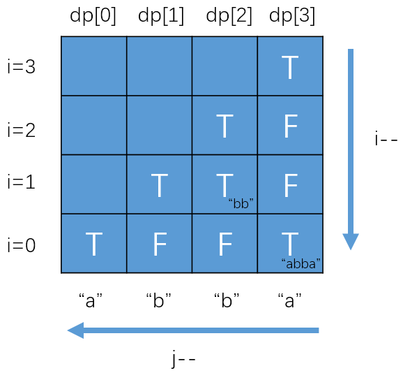

*Medium*

## Description

Given a string **s**, find the longest palindromic substring in **s**. You may assume that the maximum length of **s** is 1000.

**Example 1:**

```
Input: "babad"
Output: "bab"
Note: "aba" is also a valid answer.
```

**Example 2:**

```
Input: "cbbd"
Output: "bb"
```

## Solution 1: Expand from Center

I tend to avoid brute force solution. Trying to find all substrings seems too time-consuming. However, when I think about how to extract palindromic strings, I find that they are all symmetrical.

> The center of "aba" is "b"
>
> The center of "abba" is exactly between these two "b";

What if we check it by starting from the center and expanding to both sides. I believe it is more efficient than simply finding all substrings.

```c++
class Solution {
public:
    string longestPalindrome(string s) {
        if(s.empty()) return "";
        if(s.size() == 1)return s;
        int start = 0, end = 0;
        for(int i = 1; i < s.size(); i++){
            int len1 = findLength(s, i, i);
            int len2 = findLength(s, i-1, i);
            int max = std::max(len1, len2);
            if(max > end - start){
                start = i - max / 2;
                end = i + (max+1) / 2;
            }
        }
        return s.substr(start, end - start);
    }
    int findLength(string& s, int left, int right){
        while(left >= 0 && right <= s.size()-1 && s[left] == s[right]){
            left--;
            right++;
        }
        return right - left - 1;
    }
};
```

Time complexity: $O(n^2)$

Space complexity: $O(1)$


At first, I did not merge the two situations:

> 1. The center is one of the characters: "aba"
>
> 2. The center is between two of the characters: "abba"

After learning the idea of the official solution, I find that I could define a method `findLength(string& s, int left, int right)`.

> Call this methed twice. 
>
>             int len1 = findLength(s, i, i);
>             int len2 = findLength(s, i-1, i);

When get into the function, $left=right=i$ corresponds to "aba" situation, and $left= i-1, right=i$ is related to "abba" situation.

In each loop circle, check these two situations and update `start` and `end` (left-closes, right-opened) if it found a longer palindromic substring. Return it by the methed `substr` from `string`.

> ##### std::[string](http://www.cplusplus.com/reference/string/string/)::substr
>
> Returns a newly constructed [string](http://www.cplusplus.com/string) object with its value initialized to a copy of a substring of this object.
>
> **No string::iterator support in this function**
>
> ```c++
> #include<string>
> string str = "012345";
> int pos = 1;
> int len = 3;
> string newstr1 = str.substr(pos, len); //123
> string newstr2 = str.substr(pos); //12345
> ```


## Solution 2: Dynamic Programming

```c++
class Solution {
public:
    string longestPalindrome(string s) {
        if(s.empty()) return "";
        if(s.size() == 1)return s;
        int len = s.size();
        int start = 0, end = 0;
        vector<vector<bool> > dp(len, vector<bool>(len, false));
        for(int i = 0; i < len; i++){
            dp[i][i] = true;
            if(i+1 < len && s[i] == s[i+1]) dp[i][i+1] = true;
        }
        for(int i = len - 1; i >= 0; i--){
            for(int j = i; j < len; j++){
                if(i+1 <= j-1  && s[i] == s[j]) 
                    dp[i][j] = dp[i+1][j-1];
                if(dp[i][j] && end - start < j - i){
                    end = j;
                    start = i;
                }
            }
        }
        return s.substr(start, end - start + 1);
    }
};
```

The key point is the `dp` arrays. We define:

$P(i,j)=\left\{\begin{aligned}&true,\  if\ the\ substring\ S_i...S_j \ is \ a \ palindrome\\&false,\ otherwise\end{aligned}\right.$

The transfer equation:

$P(i,j)=(P(i+1,j-1)\ and\ S_i==S_j)$

> It looks like expanding from the center. But we use `dp` arrays to store whether the substring $S_i...S_j$ is a palindrone, thus optimize time consuming.

And we need some initial conditions:

1. Single character

   $P(i,i)=true$

2. Two consecutive identical characters

   $P(i,i+1)=(S_i==S_{i+1})$

### Why do I need to iterate `i` from the end?

For example, to know `dp[3][7]`, we need know `dp[4][6]` at first. In other word, know `dp[i+1` then know `dp[i`. As a result, we can initial `i` with the `len - 1`;

### Complexity and Optimization

Time complexity: $O(n^2)$

Space complexity: $O(n^2)$

But we actually did not use all the `dp[][]`. We don't need the space when $i> j$. And when we deal with the `i` row,  we don't need the `dp[i+2]` row. Can we use an one dimentional array `dp[]` ?

```c++
class Solution {
public:
    string longestPalindrome(string s) {
        if(s.empty()) return "";
        if(s.size() == 1)return s;
        int len = s.size();
        int start = 0, end = 0;
        vector<bool> dp(len, false);
        for(int i = len - 1; i >= 0; i--){
            for(int j = len - 1; j >= i; j--){
                dp[j] = (s[i] == s[j]) && (j - i < 3 || dp[j-1]);
                if(dp[j] && end - start < j - i){
                    end = j;
                    start = i;
                }
            }
        }
        return s.substr(start, end - start + 1);
    }
};
```

As for "abba", the change of `dp` is shown as below.



`i` and `j` both start from `len-1`. `i` end at $0$, and `j` end at `i`. The values from `i` to `len-1` in `dp` array is covered in every `i`'s loop.

